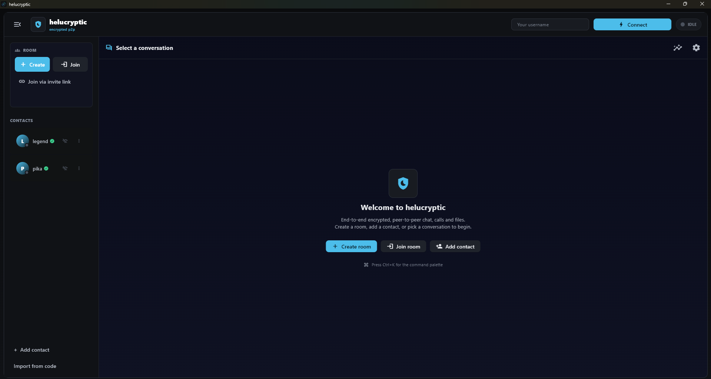

# 🛡️ helucryptic

<p align="center">
  
  
  
  
</p>

<p align="center">
  <a href="https://cryptic-mage.github.io/helucryptic/"><strong>🌐 Visit the Live Website / Documentation</strong></a>
</p>

> **Your conversations. Nobody else's hardware.**  
> A peer-to-peer, end-to-end encrypted desktop messenger where the server forgets you the moment you've shaken hands.

Most "encrypted" chat apps still funnel every word through someone else's cloud. **helucryptic** doesn't. A tiny signaling server plays matchmaker for the first few seconds - just long enough for two computers to find each other - and then **bows out completely**. From that point on, every message, file, voice packet, and pixel of your screen flows **straight from your machine to theirs**, encrypted end-to-end.

---

## 🖼️ Interface Preview

Below is a mockup preview of the Helucryptic client interface:



---

## 🗺️ How it Works

Below is an animated visualization of the signaling handshake and direct peer-to-peer WebRTC connection process:



No message ever touches a server. No file is ever parked in a bucket. There's nothing to subpoena, leak, or mine - because it was never there.

---

## ✨ Key Features

* **💬 E2EE Text Chat** – Send messages over secure WebRTC DataChannels using **PASETO v4** tokens. Supports 1-to-1 or group chat (up to 4 members).
* **🎙️ Peer-to-Peer Voice Calls** – Crystal-clear audio encoding using Opus (48kHz, mono) running fully over dedicated media tracks.
* **🖥️ Ultra-smooth Screen Share** – Low-latency screen sharing (15fps from your primary monitor) with direct audio capture integration.
* **📎 High-speed File Transfers** – Stream files directly from your disk with backpressure management (send large 4 GB files without inflating RAM) protected by SHA-256 integrity checks.
* **🔐 True Cryptography** – Forward-secret **X25519** ECDH key exchange deriving fresh session keys, paired with **Ed25519** signature verification and local history encryption.
* **🧬 Identity Verification** – Fingerprint comparisons badge verified contacts (green **✓** vs yellow **⚠**). If a verified contact's public key changes, they are instantly un-verified and flagged. First-contact (TOFU) key pinning logs a fingerprint prompt so you can verify identity out-of-band before trusting the connection. PSK challenge responses are validated against a live pending nonce, preventing replay attacks from unsolicited proofs.
* **🗄️ Local Encrypted History** – SQLite history database (WAL mode enabled) encrypted with a key derived from your private identity.
* **🌍 Intelligent Traversal & Port Mapping** – Traversing firewalls with STUN, TURN relays, and automatic NAT-PMP port forwarding via [PortForwardManager](natpmp.py). Gateway discovery probes multiple last-octet candidates (`.1`, `.254`, `.2`) to handle non-standard subnets without manual config, then falls back to ProtonVPN's gateway. Includes an automatic fail-safe threshold (deactivates after 3 consecutive failures to prevent resource/log bloat on unsupported networks).
* **👥 Dynamic Hub Failover** – Group chats automatically elect a media-routing host (the **Hub**). If the hub peer disconnects, the remaining peers automatically elect the next-best hub and seamlessly reconnect.
* **🔄 Peer-Assisted History Sync** – Connect to a room after being offline and automatically sync missing message history directly from online peers over secure DataChannels, verified and merged locally into SQLite.
* **📁 Multi-Profile Sandboxing** – Create multiple sandboxed profiles under `~/.helucryptic/profiles/`. Hot-swap between profiles instantly in settings to change identities, contacts, and history databases without restarting the application.
* **🔥 Ephemeral Rooms** – Create temporary rooms that exist purely in-RAM. Message logs, session keys, and even diagnostics buffers are completely purged on leave, leaving zero trace on the disk.
* **🛡️ Verified-Only Access Gate** – Optional configuration that automatically blocks incoming messages/calls/file streams from unknown or unverified peers, preventing unsolicited contact.
* **⚡ Multi-Layer Self-Healing** – Three independent recovery layers keep you online: (1) **WebRTC peer recovery** - a failed peer connection triggers automatic renegotiation over the still-live signaling channel, with no manual intervention needed; (2) **Signaling auto-reconnect** - an exponential-backoff loop (2 s → 30 s) silently re-joins your room if the WebSocket drops unexpectedly; (3) **Process-level restart** - unhandled asyncio exceptions trigger an OS-level process reboot, and a **Restart App** button in settings lets you trigger this manually.
* **🌐 Serverless Signaling Option** – Fully serverless, always-on signaling backend option deployed to a Cloudflare Worker + Durable Object using the WebSocket Hibernation API for zero-cost, always-on signaling.
* **🔒 Hardened Signaling Server** – Both the FastAPI and Cloudflare Worker backends enforce token-bucket rate limiting (20 new connections/IP/60 s; 100 signaling messages/user/10 s) and strict room isolation that blocks cross-room signals at the server level. The server also reflects each client's public IP back in the session handshake so the WebRTC engine can make more accurate hub-election decisions.

---

## 🔒 The Cryptographic Stack

| Component | Technology / Primitive | Description |
| :--- | :--- | :--- |
| **Key Agreement** | `Ephemeral X25519 ECDH` | Fresh keypair generated per session, signed by Ed25519 → HKDF-SHA256 |
| **Identity Verification** | `Ed25519` via PASETO v4.public | Authenticates peer handshake identity tokens |
| **Message Encryption** | `PASETO v4.local` | Symmetric XChaCha20-Poly1305 payload encryption |
| **History at Rest** | `PASETO v4.local` | Database-level sqlite encryption keyed from local identity |
| **Identity Protection** | `OS Keystore / DPAPI` | Identity keypair wrapped securely at rest on your filesystem |

---

## 🗺️ Project Layout

Explore the architecture of the codebase:

| Module / File | Role |
| :--- | :--- |
| [main.py](main.py) | App entry point (initializes the Flet interface). |
| [client.py](client.py) | Main Flet UI: [HelucrypticApp](client.py) handles chat layout, presence tracking, settings, logs capture, and UI state. |
| [webrtc_engine.py](webrtc_engine.py) | Core engine: [WebRTCEngine](webrtc_engine.py) manages WebRTC peer connections, voice track mixing, screen capture, and file transfer streams. |
| [server.py](server.py) | FastAPI signaling server: [app](server.py) relays SDP/ICE handshake payloads and serves presence queries. |
| [cloudflare/](cloudflare/) | Serverless signaling server implementation for deployment on Cloudflare Workers ([SignalHub](cloudflare/src/index.js) Durable Object). |
| [natpmp.py](natpmp.py) | Implements NAT-PMP protocols via [PortForwardManager](natpmp.py) to request automatic gateway port mapping. |
| [crypto.py](crypto.py) | Handles identity keys, PASETO token generation, X25519 agreements, and verification. |
| [contacts.py](contacts.py) / [history.py](history.py) | SQLite local persistence engines for contact registries and encrypted message history. |
| [settings.py](settings.py) | Configuration schema & manager: [load_settings](settings.py) handles DTLS vs E2EE modes, retention, TURN, and Verified-Only gating. |
| [paths.py](paths.py) | Resolves data directory locations and active profiles. |
| [profiles.py](profiles.py) | Manages sandboxed profile environments. |
| [secure_store.py](secure_store.py) | OS Keystore integrations (DPAPI for Windows) to wrap private keys securely. |
| [invites.py](invites.py) | Decentralized room invitation codec utilizing [encode_invite](invites.py). |
| [sounds.py](sounds.py) | Audio feedback manager (cues connection sounds and incoming call ringing). |

---

## 🚀 Quick Start

Select your operating system to auto-configure and view the correct setup commands:

<details open>
<summary><b>💻 Windows (PowerShell / Command Prompt)</b></summary>

```powershell
# 1. Install dependencies (PortAudio is automatically bundled)
pip install -r requirements.txt

# 2. Start the local signaling server
python -m uvicorn server:app --host 127.0.0.1 --port 8000

# 3. Launch the client in another terminal
python main.py
```

</details>

<details>
<summary><b>🍎 macOS (Terminal)</b></summary>

```bash
# 1. Install dependencies (requires PortAudio)
brew install portaudio
pip install -r requirements.txt

# 2. Start the local signaling server
python3 -m uvicorn server:app --host 127.0.0.1 --port 8000

# 3. Launch the client in another terminal
python3 main.py
```

</details>

<details>
<summary><b>🐧 Linux (Terminal)</b></summary>

```bash
# 1. Install dependencies (requires PortAudio)
sudo apt install portaudio19-dev -y
pip install -r requirements.txt

# 2. Start the local signaling server
python3 -m uvicorn server:app --host 127.0.0.1 --port 8000

# 3. Launch the client in another terminal
python3 main.py
```

</details>

> [!TIP]
> **Connecting with Friends**: Create a room, click the **person+** or **link** icon next to the room header to copy a decentralized invite link (`HELU-INV1:`). When your friend pastes this invite code, their client will automatically point to the correct signaling server and join the encrypted room instantly.

### 🌐 Serverless Signaling (Cloudflare Workers Deploy)

Instead of hosting a local FastAPI server, you can deploy a serverless, always-on signaling hub to Cloudflare Workers:

```bash
cd cloudflare
npm install -g wrangler     # Install wrangler CLI if needed
wrangler login              # Log in to your Cloudflare account
wrangler deploy             # Deploy to workers.dev
```

Once deployed, copy the generated `.workers.dev` URL, open the desktop app settings, choose **Custom Server**, and enter the URL (e.g., `https://helucryptic-signaling.<your-subdomain>.workers.dev`). For more details, see the [Cloudflare README](cloudflare/README.md).

---

## ⚙️ Configuration

helucryptic is completely environment-driven. To override defaults, copy `.env.example` to `.env`:

```bash
cp .env.example .env
```

### Key Environment Variables

* `HELUCRYPTIC_SIGNALING_URL` – WebSocket target of the signaling server. Pre-configured by default to the public Cloudflare Worker (`wss://helucryptic-signaling.crypticmage00.workers.dev/`) for instant connectivity.
* `HELUCRYPTIC_SERVER_PASSWORD` – Access password checked by the signaling server before allowing connections.
* `HELUCRYPTIC_LOW_PERF_MODE` – Set to `true` to drop capture settings (ideal for low-end hardware).
* `HELUCRYPTIC_TURN_URL` / `_USERNAME` / `_PASSWORD` – Traversal credentials to configure optional TURN relays.
* `HELUCRYPTIC_CF_TURN_KEY_ID` / `_API_TOKEN`, or `HELUCRYPTIC_TURN_STATIC_SECRET` – *Server-side only.* Let the signaling server mint short-lived relay credentials that clients fetch automatically. See [docs/TURN_SETUP.md](docs/TURN_SETUP.md).
* `HELUCRYPTIC_DATA_DIR` – Folder containing your keys, settings, and database (defaults to `~/.helucryptic`).

> [!WARNING]
> **Testing Multiple Clients Locally**: If running two clients on the same machine, they must use different data directories to prevent them from reading the same identity keys.
>
> <details open>
> <summary><b>💻 Windows (PowerShell)</b></summary>
>
> ```powershell
> $env:HELUCRYPTIC_DATA_DIR="C:\hc\alice"; python main.py
> $env:HELUCRYPTIC_DATA_DIR="C:\hc\bob";   python main.py
> ```
>
> </details>
>
> <details>
> <summary><b>💻 Windows (Command Prompt)</b></summary>
>
> ```cmd
> set HELUCRYPTIC_DATA_DIR=C:\hc\alice && python main.py
> set HELUCRYPTIC_DATA_DIR=C:\hc\bob && python main.py
> ```
>
> </details>
>
> <details>
> <summary><b>🍎 macOS &amp; 🐧 Linux (Bash/Zsh)</b></summary>
>
> ```bash
> HELUCRYPTIC_DATA_DIR="~/hc/alice" python3 main.py
> HELUCRYPTIC_DATA_DIR="~/hc/bob" python3 main.py
> ```
>
> </details>

---

## 📡 Traversal & TURN Relay Setup

WebRTC will naturally attempt direct connections, but cellular hotspots and corporate routers (Symmetric NATs) require a relay fallback. When required, the **still-encrypted** media is passed through your configured TURN server.

> [!IMPORTANT]
> Behind carrier-grade NAT there is **no** client-side trick that produces a direct path – the router hands your packets a different external port than the one STUN reported, so hole-punching cannot work. A relay is the only transport. Text chat still flows over the encrypted signaling relay; voice, video, screen share and file transfer need TURN. [docs/TURN_SETUP.md](docs/TURN_SETUP.md) walks through why, and through wiring the signaling server to mint credentials so every user gets a relay without configuring one.

### 0. Server-Minted Credentials (Recommended)

Point the signaling server at a TURN provider once, and every client picks up short-lived credentials from `GET /turn` on connect – no per-user setup and no relay secret inside the shipped binary. Cloudflare Realtime TURN (1 TiB/month free), coturn's `use-auth-secret`, and static provider credentials are all supported; see [docs/TURN_SETUP.md](docs/TURN_SETUP.md).

### 1. Managed Cloud Providers

You can register for a free/metered tier at one of the following providers and input the host details in your `.env`:

* **Metered.ca** – High-performance global TURN nodes (includes a generous free tier).
* **Twilio Network Traversal** – Pay-as-you-go TURN/STUN pricing.
* **Xirsys** – Developer-oriented WebRTC traversal plans.

### 2. Self-Host using `coturn` (Linux VPS)

To host your own traversal infrastructure on a Linux VPS:

1. **Install `coturn`**:

    ```bash
    sudo apt update && sudo apt install coturn -y
    ```

2. **Edit the configuration** (`/etc/turnserver.conf`):

    ```ini
    listening-port=3478
    fingerprint
    lt-cred-mech
    user=my-turn-username:my-turn-password-456
    realm=your-turn-server-domain.com
    ```

3. **Allow traffic on ports**:

    ```bash
    sudo ufw allow 3478/tcp
    sudo ufw allow 3478/udp
    sudo ufw allow 49152:65535/udp
    ```

4. **Restart service**:

    ```bash
    sudo systemctl enable turnserver && sudo systemctl restart turnserver
    ```

### 3. Testing Configurations & Diagnostics

The project includes a robust validation test suite (`tests/`) to verify traversal parameters, including TURN credential validation and port-forwarding mappings (run via `pytest`).

---

## 📦 Standalone Executable Build

Compile a standalone, zero-dependency executable for distribution:

```bash
python build.py
```

This script automates the compilation workspace and saves the portable output to `dist/Helucryptic`.

---

## 🪶 Performance & Resilience Optimizations

helucryptic is optimized to run smoothly on legacy devices:

* **Frame Repaints**: Screenshare streams update only changed layout controls rather than redrawing the Flet canvas.
* **Backpressure Handling**: File transfers are segmented and stream chunks directly from/to disk to avoid memory inflation.
* **Engine Decoupling**: SQLite operations run in WAL mode with active indexing to safeguard against disk bottlenecks.
* **Resilience & Self-Healing**: Failed WebRTC peer connections renegotiate automatically without dropping the signaling channel. Unexpected WebSocket disconnects are recovered silently via an exponential-backoff loop. Unhandled asyncio exceptions reboot the process automatically. Stale `.part` temp files left by interrupted transfers are purged on startup.

---

## 🛡️ Security Model & Limitations

We value absolute honesty over marketing:

* **Signaling Privacy**: The server coordinates connection handshakes but is mathematically excluded from knowing private keys, decrypted chat, files, or call audio.
* **Fingerprint Verification**: Always verify peer identity badges manually out-of-band to prevent active MITM handshakes.
* **Group Relays**: Rooms route media streams through the elected room host (the **Hub**). While text and files are fully E2EE with the room key, the media relay is decrypted at the hub host for forwarding (requires trust in the elected hub peer).
* **Protected Identity**: Key pairs saved locally in `keys.json` are wrapped with Windows DPAPI on Windows, making copies unusable on another host or account.
* **Verified-Only Mode**: Users can toggle Verified-Only mode in settings, blocking messages/calls/files from anyone whose fingerprint has not been manually verified or explicitly whitelisted for the active session.

---

📧 For general inquiries or questions, contact <crypticmage00@gmail.com>.


